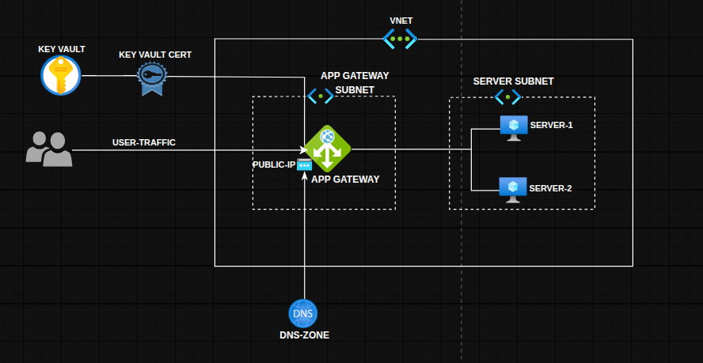

# Infrastructure as Code (IaC) – Terraform Project

A Terraform-based Infrastructure as Code (IaC) project for provisioning and managing networking, compute, load balancing, security, and certificate in a modular, and reusable way on Microsoft Azure.

---
## Infrastructure Diagram


---

## 📌 Overview

This repository contains Terraform configurations and reusable modules used to provision a production-ready Azure infrastructure for hosting a backend application.

The infrastructure includes networking, compute, security, load balancing, and certificate management components deployed using a modular Terraform architecture.

The design emphasizes reusability, environment isolation, and infrastructure automation.

Key goals of this project:

* Production-ready Azure infrastructure deployment
* Modular and reusable Terraform modules
* Environment separation using .tfvars files
* Secure identity and access management using Azure Managed Identities
* Scalable backend architecture using Virtual Machines, Load Balancer, and Application Gateway
* Secure certificate management using Azure Key Vault

---

## 🧱 Project Structure

```
terraform/
│
├── main/                     # Main infrastructure deployment
│   ├── backend.tf
│   ├── data.tf
│   ├── locals.tf
│   ├── main.tf
│   ├── outputs.tf
│   ├── terraform.tfvars
│   └── variables.tf
│
├── modules/                  # Reusable Terraform modules
│
│   ├── rg/                   # Resource group module
│   ├── vnet/                 # Virtual network
│   ├── subnet/               # Subnet configuration
│   ├── secGroup/             # Network security groups
│   ├── vm/                   # Virtual machines
│   ├── appGateway/           # Application gateway
│   ├── publicIp/             # Public IP resources
│
│   ├── akv/                  # Azure Key Vault
│   ├── akv_access_policy/    # Key Vault access policies
│   ├── akv_cert/             # Key Vault certificates
│
│   ├── storage_account/      # Storage account
│   ├── storage_container/    # Blob container
│   ├── storage_blob/         # Blob resources
│
│   └── user_assigned_identities  # Managed identities
│
├── rg/                       # Bootstrap resource group deployment
│
├── storage/                  # Terraform state storage setup
│
└── README.md
```

---

## ⚙️ Prerequisites

Before using this project, ensure the following tools, access, and permissions are correctly configured on your Linux environment.

* Terraform >= 1.5 is used to provision and manage all infrastructure resources. Follow LINK to install terraform in Linux environment.
* Azure CLI (`az`) is required for authentication and for Terraform to interact with Azure.
  * Install Azure CLI (Linux):
  * Login to Azure with an active subscription ID:
    ```bash
    az login
    az account set --subscription <SUBSCRIPTION_ID>
    ```
  * Verify:
    ```bash
    az account show
    ```
* Proper Azure permissions (Owner/Contributor or scoped RBAC) for Terraform to create and manage resources.

  * Subscription level (simplest): Owner or Contributor
  * Scoped (more secure approach): 
    * Contributor on target Resource Group
    * User Access Administrator (if assigning roles)
    * Key Vault Administrator (if managing secrets)

---

## 🚀 Usage

This project uses Azure Storage as the Terraform remote backend for state management.

Since the backend storage must exist before Terraform can use it, the infrastructure is bootstrapped in stages.

### 1. Resource Group Bootstrap

First, create the resource group that will contain the Terraform state storage.

    cd terraform/rg

    terraform init
    terraform fmt
    terraform validate
    terraform plan -var-file"terraform.tfvars"
    terraform apply -var-file"terraform.tfvars"

### 2. Storage Backend Deployment

Next, deploy the storage account and container that will store the Terraform state file.

    cd terraform/storage

    terraform init
    terraform fmt
    terraform validate
    terraform plan -var-file"terraform.tfvars"
    terraform apply -var-file"terraform.tfvars"

### 3. Main Infrastructure Deployment

    cd terraform/main

    terraform init
    terraform fmt
    terraform validate
    terraform plan -var-file"terraform.tfvars"
    terraform apply -var-file"terraform.tfvars"

This deployment provisions the full infrastructure including:

* Virtual Network
* Subnets
* Network Security Groups
* Virtual Machines
* Load Balancer
* Application Gateway
* Azure Key Vault
* Managed Identities

## 🔐 Security Considerations

* Network segmentation using dedicated subnets for the Application Gateway and backend servers
* Network Security Groups (NSGs) to restrict inbound and outbound traffic
* Backend servers isolated from the internet with no direct public IP exposure
* Application Gateway used as the single entry point for external traffic
* HTTPS/TLS encryption using certificates stored in Azure Key Vault
* Secure certificate storage and lifecycle management through Azure Key Vault
* Managed identities used for secure authentication between Azure services
* Principle of least privilege applied to resource access and permissions
* Terraform remote state stored securely in Azure Blob Storage
* Infrastructure access controlled through Azure RBAC

---

## 📦 State Management

Terraform state is stored remotely in Azure Blob Storage, enabling:

* Shared state access
* State locking
* Safer team collaboration
* Recovery and versioning

---
